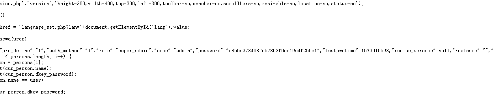
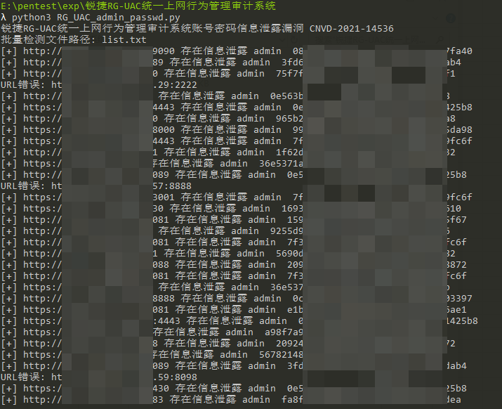

# 说明

锐捷RG-UAC统一上网行为管理审计系统前台存在账号密码信息泄露,可以间接获取用户账号密码信息登录后台

# 指纹

> title="RG-UAC登录页面" && body="admin"

# 使用

`python3 RG_UAC_admin_passwd.py`，指定待检测文件路径

# 引用

[锐捷RG-UAC统一上网行为管理审计系统账号密码信息泄露漏洞 CNVD-2021-14536](https://mp.weixin.qq.com/s/LbSPzt__mKdNN83RhJ2bwA)